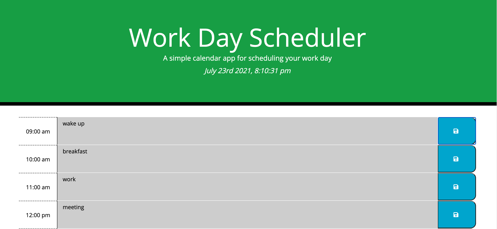
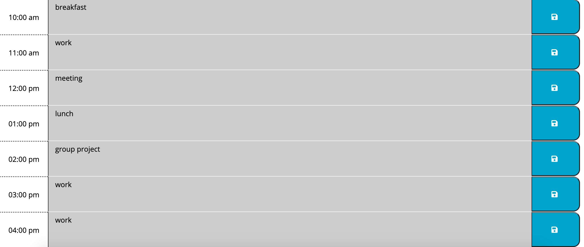
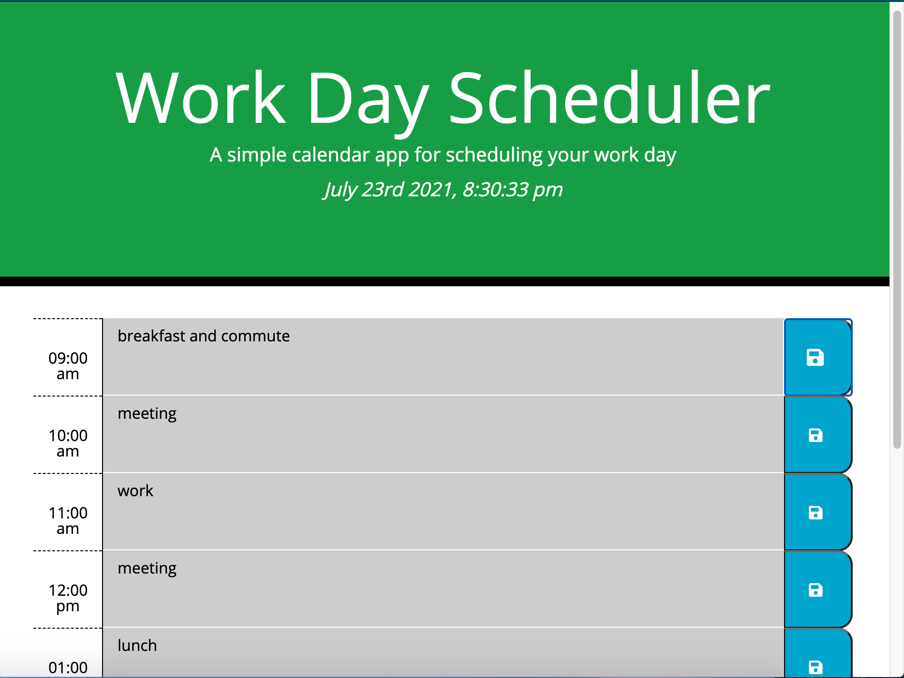

# Work-Day-Scheduler

## Purpose
This is a simple Work-Day-Scheduler web Application that allows you to save all your projects and tasks during business hours by entering the information in the text area and clicking the save(floppy disk) icon. Information is saved in localStorage so you can refresh the page and your tasks will be there.. Also, keeps track of the time of the day so you know when to do your tasks thanks to moment.js

## Built with
* HTML
* CSS
* Javascript
* DOM
* JQuery
* BootStraps
* Moment.js

## Website

https://walterlaw19.github.io/code-quiz/

## Screenshots

 "Screenshot1"
 "Screenshot2"
 "Screenshot3"


## contribution
```
Made by by Walter G
```

---
##### © 2021 WG.